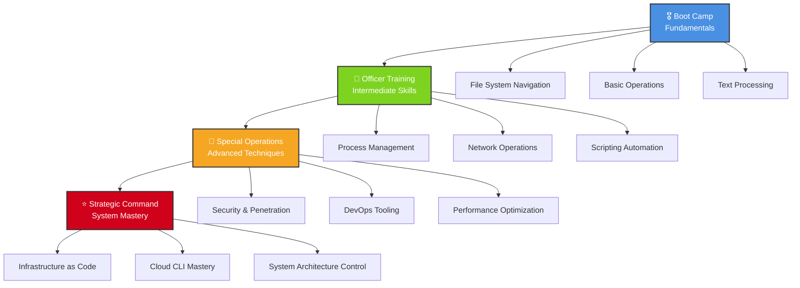
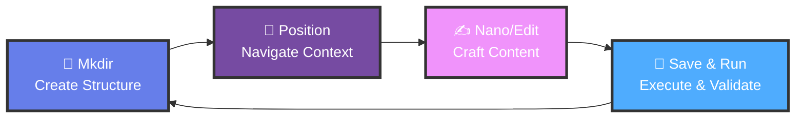
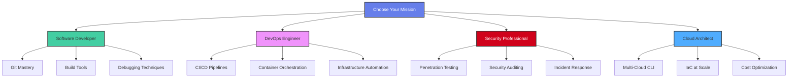
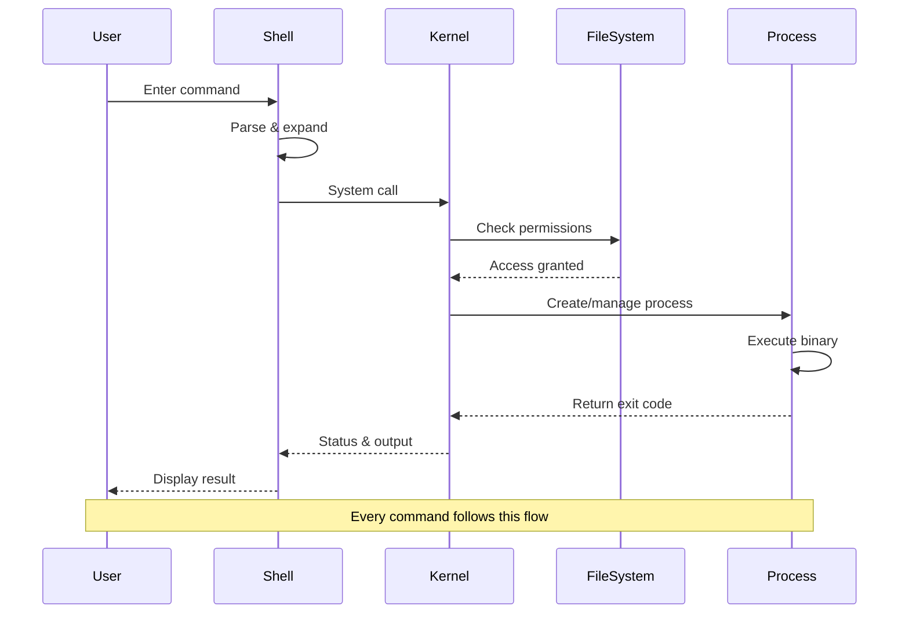

# 🧠 CLI Sovereign Mastery Framework

[](https://opensource.org/licenses/MIT)
[](https://www.credly.com/users/triumphanthanis)
[](https://github.com/novusaevum/cli-sovereign-mastery)
[](http://makeapullrequest.com)

> **"Control your entire system through terminal. From boot camp to strategic command."**

**Enterprise-grade command line interface mastery framework developed by [Wan Mohamad Hanis bin Wan Hassan](https://www.linkedin.com/in/wanmohamadhanis)** — Transdisciplinary expert in AI, Cybersecurity (CEH v12), Cloud Computing (GCP, AWS, Azure), and Digital Transformation with 100+ global certifications.

---

## 🎯 Mission Statement

This repository transforms command line interface knowledge from scattered commands into a systematic mastery framework. Built on the **MPNS™ Methodology** (Mkdir → Position → Nano → Save), this guide takes you from basic file operations to complete system sovereignty through terminal control.

**What makes this different:** Every command is contextualized with security implications, performance considerations, real-world enterprise scenarios, and cross-platform nuances. No toy examples—only production-grade knowledge.

---

## 🗺️ Learning Architecture



---

## ⚡ The MPNS™ Methodology

The foundation of terminal mastery lies in a repeatable, muscle-memory pattern that works across all scenarios:



**Psychological Foundation:** This pattern leverages spatial memory, procedural learning, and consistent context switching to build permanent neural pathways. Military-grade repetition transforms conscious commands into unconscious reflex.

---

## 📚 Documentation Structure

### Core Modules

The framework is organized into progressive skill levels, each building upon previous foundations:
| Level | Module | Content | Certification Alignment |
|-------|--------|---------|------------------------|
| 🎖️ **Boot Camp** | [Fundamentals](docs/01-boot-camp/README.md) | File system, basic operations, text processing | CompTIA Linux+, LPIC-1 |
| 👔 **Officer Training** | [Intermediate Skills](docs/02-officer-training/README.md) | Process management, networking, scripting | RHCSA, AWS SysOps |
| 🎯 **Special Operations** | [Advanced Techniques](docs/03-special-operations/README.md) | Security, DevOps, optimization | CEH v12, CKA, GCP Architect |
| ⭐ **Strategic Command** | [System Mastery](docs/04-strategic-command/README.md) | Infrastructure as Code, multi-cloud CLI | AWS Solutions Architect, Terraform Associate |

### Specialized Arsenals

In addition to the progressive modules, specialized guides cover domain-specific expertise:

- **[🛡️ Cybersecurity Operations](docs/security/README.md)** — Offensive and defensive CLI techniques, OSINT, penetration testing workflows
- **[☁️ Cloud Platform Mastery](docs/cloud/README.md)** — AWS CLI, Google Cloud SDK, Azure CLI, multi-cloud orchestration
- **[🐳 Containerization & Orchestration](docs/containers/README.md)** — Docker, Kubernetes, container security and optimization
- **[📊 Monitoring & Observability](docs/monitoring/README.md)** — System metrics, log analysis, performance profiling
- **[⚙️ Automation & IaC](docs/automation/README.md)** — Terraform, Ansible, CI/CD pipeline scripting

---

## 🚀 Quick Start

### Installation Prerequisites

```bash
# Verify your terminal environment
echo $SHELL                    # Confirm shell type (bash/zsh/sh)
which python3 node git docker  # Check essential tools
uname -a                       # System information
```

### Clone and Initialize

```bash
# Clone repository
git clone https://github.com/novusaevum/cli-sovereign-mastery.git
cd cli-sovereign-mastery

# Make scripts executable
chmod +x scripts/*.sh

# Run environment check
./scripts/env-check.sh
```

### Your First MPNS Cycle

Execute your first complete MPNS workflow to establish the pattern:
```bash
# M — Create project structure
mkdir -p ~/learning/first-mpns-project

# P — Position into context
cd ~/learning/first-mpns-project

# N — Create and edit file
nano hello.sh

# Paste this content:
#!/bin/bash
echo "🎖️ MPNS Protocol Activated"
echo "System: $(uname -s)"
echo "User: $(whoami)"
echo "Timestamp: $(date)"

# S — Save (CTRL+O, Enter, CTRL+X) and execute
chmod +x hello.sh
./hello.sh
```

**Expected Output:**
```
🎖️ MPNS Protocol Activated
System: Darwin
User: wmh
Timestamp: Sun Oct 19 14:32:17 +08 2025
```

**Congratulations!** You've completed your first MPNS cycle. This pattern will become reflexive through repetition.

---

## 🎓 Learning Paths

Different professionals require different skill trajectories. Choose your path:



### Recommended Progression

1. **Week 1-2:** Complete Boot Camp module — Build foundational muscle memory
2. **Week 3-4:** Officer Training — Add automation and networking skills  
3. **Week 5-6:** Choose specialization path based on your professional focus
4. **Week 7-8:** Special Operations — Advanced techniques for your domain
5. **Ongoing:** Strategic Command — Continuous mastery and optimization

---

## 💡 Key Differentiators

### Security-First Mindset

Every command includes security implications from both offensive and defensive perspectives:
- **🛡️ Threat Modeling:** Understand how commands can be weaponized or exploited
- **🔒 Defense Patterns:** Learn protection mechanisms and secure configurations
- **🎯 Real Attack Scenarios:** Based on CEH v12 and TryHackMe insane-level CTF experience

### Cross-Platform Excellence

Commands work across Linux, macOS, and Windows (WSL2), with platform-specific notes where behavior differs. No assumptions—explicit guidance for every environment.

### Enterprise Production Ready

All scripts and examples include:
- ✅ Comprehensive error handling and validation
- ✅ Logging and audit trail capabilities  
- ✅ Input sanitization and security checks
- ✅ Performance optimization considerations
- ✅ Scalability and maintainability patterns

### Real-World Context

Every technique is contextualized within actual enterprise scenarios drawn from AI development, cloud architecture, cybersecurity operations, and digital transformation projects.

---

## 🛠️ Automation Scripts

The `scripts/` directory contains production-ready automation utilities that demonstrate CLI mastery principles in action:

| Script | Purpose | Complexity |
|--------|---------|------------|
| `env-check.sh` | System environment validation and readiness check | Beginner |
| `project-scaffold.sh` | Multi-language project structure generator with git init | Intermediate |
| `security-audit.sh` | Automated security posture assessment | Advanced |
| `cloud-sync.sh` | Multi-cloud resource synchronization utility | Advanced |
| `performance-monitor.sh` | Real-time system performance tracking | Intermediate |
| `backup-orchestrator.sh` | Intelligent backup with rotation and compression | Advanced |

Each script serves as both a learning tool and a production utility you can immediately deploy in real workflows.

---

## 🔥 Command Execution Flow

Understanding how commands flow through your system is critical for mastery:



**Mastery Insight:** When you understand this flow, you can optimize at each stage—from shell expansion to process management to output handling.

---

## 📖 Documentation Standards

All documentation in this repository follows these principles:
### Clarity is the Weapon

- **Zero Fluff:** Every sentence delivers actionable value
- **Precision:** Commands are exact with all required flags and options explicitly stated
- **Evidence-Based:** Best practices backed by official documentation and industry standards
- **No Assumptions:** Platform differences, version requirements, and prerequisites always specified

### Progressive Disclosure

- **Beginner-Friendly Start:** Core concepts explained without jargon
- **Intermediate Depth:** Context and optimization opportunities introduced
- **Advanced Nuances:** Edge cases, security implications, and enterprise considerations
- **Expert References:** Links to RFCs, CVEs, and authoritative specifications

---

## 🤝 Contributing

This framework thrives on community expertise. Contribution guidelines:

### Acceptable Contributions

✅ **Real-world enterprise scenarios** from production environments  
✅ **Security vulnerability discoveries** with responsible disclosure  
✅ **Performance optimization techniques** with benchmarks  
✅ **Cross-platform compatibility fixes** with testing evidence  
✅ **Automation scripts** that follow the established quality standards  

### Quality Standards

All contributions must meet these criteria:

1. **Enterprise Grade:** Production-ready with proper error handling
2. **Security Reviewed:** No introduction of vulnerabilities or insecure patterns
3. **Well Documented:** Inline comments, usage examples, and edge case handling
4. **Tested:** Works across stated platforms with evidence of testing
5. **Licensed:** Compatible with MIT license

### Submission Process

```bash
# Fork and clone
git clone https://github.com/YOUR_USERNAME/cli-sovereign-mastery.git
cd cli-sovereign-mastery

# Create feature branch
git checkout -b feature/your-contribution

# Make changes following MPNS methodology
mkdir -p docs/your-section
cd docs/your-section
nano your-content.md

# Test thoroughly across platforms
./scripts/validate-contribution.sh

# Commit with clear message
git add .
git commit -m "feat: Add advanced SSH tunneling techniques"

# Push and create PR
git push origin feature/your-contribution
```

---

## 🎖️ Certification Alignment

This framework aligns with and supports preparation for these professional certifications:
### Linux & System Administration
- **CompTIA Linux+** — Boot Camp module covers 60% of exam objectives
- **LPIC-1 & LPIC-2** — Comprehensive coverage of Linux administration
- **RHCSA/RHCE** — Red Hat specific commands and workflows included

### Cloud Platforms
- **AWS Certified SysOps Administrator** — Complete AWS CLI coverage
- **Google Cloud Professional Cloud Architect** — gcloud command mastery
- **Microsoft Azure Administrator** — Azure CLI and PowerShell integration

### Security & Penetration Testing
- **Certified Ethical Hacker (CEH v12)** — Command-line based attack vectors
- **OSCP** — Privilege escalation and enumeration techniques
- **CompTIA Security+** — Security hardening through CLI

### DevOps & Automation
- **Certified Kubernetes Administrator (CKA)** — kubectl mastery
- **HashiCorp Certified: Terraform Associate** — Infrastructure as Code CLI
- **AWS Certified DevOps Engineer** — Pipeline automation

**Note:** This framework is educational material developed from real-world experience. Always refer to official certification documentation for exam-specific requirements.

---

## ⚠️ Security & Legal Notice

### Ethical Use Only

All security-related content is provided for:
- ✅ Authorized penetration testing with written permission
- ✅ Security research in controlled environments
- ✅ Educational purposes and skill development
- ✅ Defending your own systems and infrastructure

**Prohibited Uses:**
- ❌ Unauthorized access to systems or data
- ❌ Malicious exploitation of vulnerabilities
- ❌ Any activity violating local, national, or international law

### Responsibility Clause

Users of this framework are solely responsible for ensuring their activities comply with all applicable laws and regulations. The author and contributors assume no liability for misuse of the information provided.

---

## 📊 Progress Tracking

Track your mastery journey using this self-assessment framework:

```mermaid
graph LR
    A[Awareness<br/>Can recognize command] --> B[Understanding<br/>Can explain what it does]
    B --> C[Application<br/>Can use in context]
    C --> D[Analysis<br/>Can debug and optimize]
    D --> E[Synthesis<br/>Can combine with others]
    E --> F[Mastery<br/>Can teach and innovate]
    
    style A fill:#e3f2fd,stroke:#333,stroke-width:2px
    style B fill:#bbdefb,stroke:#333,stroke-width:2px
    style C fill:#90caf9,stroke:#333,stroke-width:2px
    style D fill:#64b5f6,stroke:#333,stroke-width:2px
    style E fill:#42a5f5,stroke:#333,stroke-width:2px
    style F fill:#2196f3,stroke:#333,stroke-width:2px,color:#fff
```



### Self-Assessment Checklist](https://git-scm.com/book/en/v2) by Scott Chacon — Git mastery
- [Advanced Bash-Scripting Guide](https://tldp.org/LDP/abs/html/) — Deep dive into scripting
- [AWS CLI Documentation](https://docs.aws.amazon.com/cli/) — Cloud command reference
- [Kubernetes Documentation](https://kubernetes.io/docs/reference/kubectl/) — Container orchestration

### Security Resources
- [OWASP Testing Guide](https://owasp.org/www-project-web-security-testing-guide/) — Security testing methodology
- [GTFOBins](https://gtfobins.github.io/) — Unix binary exploitation reference
- [HackTricks](https://book.hacktricks.xyz/) — Penetration testing techniques

---

## 🏆 Author & Maintainer

**Wan Mohamad Hanis bin Wan Hassan**

Transdisciplinary technologist specializing in AI, cybersecurity, and cloud computing with 100+ global certifications including CEH v12, multiple cloud architect certifications (AWS, GCP, Azure), and advanced credentials from IBM, Google, Cisco, and EC-Council.

**Professional Background:**
- 🤖 AI & Machine Learning Expert (IBM, Google, AWS certified)
- 🛡️ Certified Ethical Hacker (CEH v12) with TryHackMe insane-level CTF completions
- ☁️ Multi-Cloud Architect (Google Cloud, AWS, Microsoft Azure)
- 📈 Digital Marketing & Business Development Strategist
- 🎯 OSINT & Advanced Reconnaissance Specialist

**Connect:**
- 🔗 [LinkedIn](https://www.linkedin.com/in/wanmohamadhanis)
- 💻 [GitHub](https://github.com/novusaevum)
- 🏅 [Credly](https://www.credly.com/users/triumphanthanis)
- 🌐 [Portfolio](https://wanmohamadhanis.my.canva.site/wmh-portfolio)
- 👨‍💻 [Google Developer Profile](https://g.dev/triumphanthanis)

---

## 📜 License

MIT License — Copyright (c) 2025 Wan Mohamad Hanis bin Wan Hassan

Permission is hereby granted, free of charge, to any person obtaining a copy of this software and associated documentation files (the "Software"), to deal in the Software without restriction, including without limitation the rights to use, copy, modify, merge, publish, distribute, sublicense, and/or sell copies of the Software, and to permit persons to whom the Software is furnished to do so, subject to the following conditions:

The above copyright notice and this permission notice shall be included in all copies or substantial portions of the Software.

THE SOFTWARE IS PROVIDED "AS IS", WITHOUT WARRANTY OF ANY KIND, EXPRESS OR IMPLIED, INCLUDING BUT NOT LIMITED TO THE WARRANTIES OF MERCHANTABILITY, FITNESS FOR A PARTICULAR PURPOSE AND NONINFRINGEMENT. IN NO EVENT SHALL THE AUTHORS OR COPYRIGHT HOLDERS BE LIABLE FOR ANY CLAIM, DAMAGES OR OTHER LIABILITY, WHETHER IN AN ACTION OF CONTRACT, TORT OR OTHERWISE, ARISING FROM, OUT OF OR IN CONNECTION WITH THE SOFTWARE OR THE USE OR OTHER DEALINGS IN THE SOFTWARE.

---

## 🙏 Acknowledgments

This framework synthesizes knowledge from decades of Unix/Linux development, contributions from the open-source community, and lessons learned from enterprise deployments across Fortune 500 companies and startups alike.

Special recognition to:
- The GNU Project and Free Software Foundation
- Linux kernel developers and maintainers
- Cloud platform engineering teams (AWS, GCP, Azure)
- Information security researchers and the ethical hacking community
- DevOps pioneers who championed automation and infrastructure as code

---

## 🚀 Roadmap

### Q4 2025
- [ ] Interactive CLI tutorials with embedded validation
- [ ] Video walkthrough series for complex operations
- [ ] Community-contributed real-world scenarios library
- [ ] Integration with popular certification exam objectives

### Q1 2026
- [ ] CLI mastery assessment platform
- [ ] Multi-language support (documentation translation)
- [ ] Advanced automation scripts for enterprise scenarios
- [ ] Collaboration with certification bodies for official alignment

### Q2 2026
- [ ] Mobile companion app for on-the-go reference
- [ ] AI-powered command suggestion engine
- [ ] Gamification and achievement system
- [ ] Enterprise training program partnerships

---

**⭐ If this framework helps you achieve terminal mastery, please consider:**
- Starring this repository
- Sharing with your professional network
- Contributing your own expertise and scenarios
- Providing feedback for continuous improvement

---

<div align="center">

**🧠 Built with discipline. Delivered with precision. Maintained with excellence.**

*From the desk of Wan Mohamad Hanis bin Wan Hassan*

**"Master the terminal. Control your entire system."**

</div>
